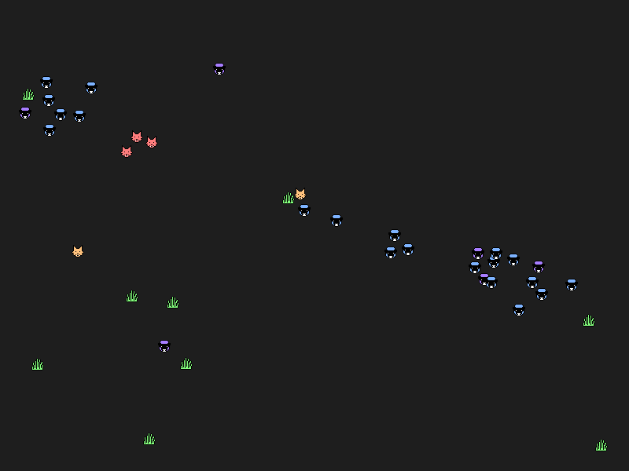

# Wolves and Sheep

Wolves eat sheep. Sheep eat grass.

Fed animals stop seeking food and look for a fed member of the same species to mate with. When two of them touch, a new offspring spawns at the location of either of them and the parents become hungry again. If a fed animal does not find a mate in time, it becomes hungry again. If a hungry animal does not find food in time, it disappears.

Boid movement priority, from highest to lowest: running from predators, seeking food, seeking mate.

The simulation has three possible outcomes: no survivors (the wolves eat all the sheep, then starve), one sheep survives (the wolves eat all the sheep but one, then starve, leaving the sheep without any possible mate but with enough grass to survive), or more than one sheep survive.

# Instructions (command prompt):
1. Create a virtual environment

python -m venv venv

2. Activate it

venv\Scripts\activate

3. Install dependencies

pip install -r requirements.txt

4. Run main.py

# Team:
Codescu Alexandru

# Materials used:
https://vanhunteradams.com/Pico/Animal_Movement/Boids-algorithm.html